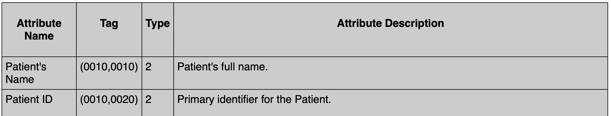
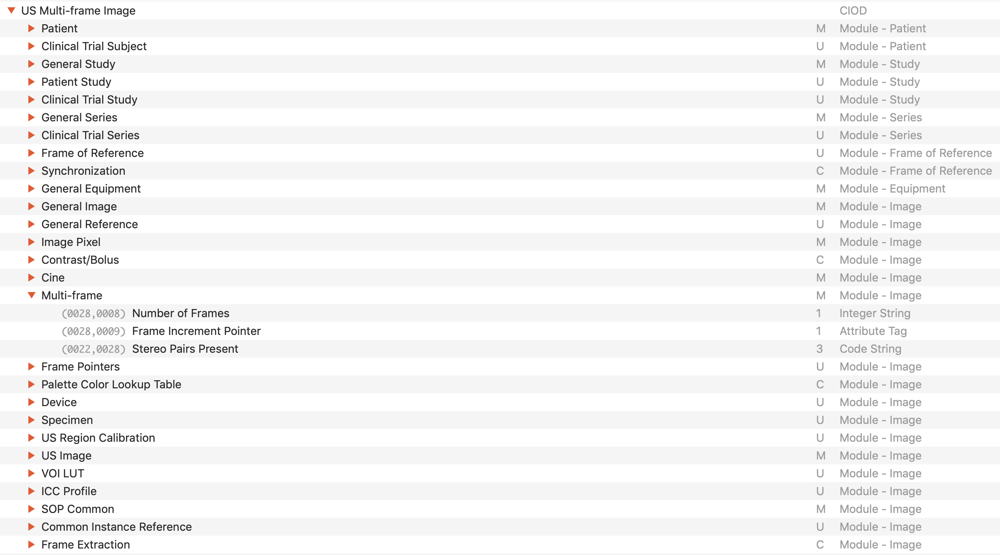
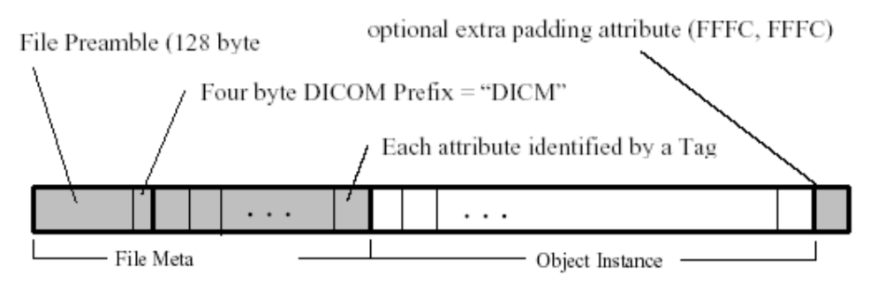
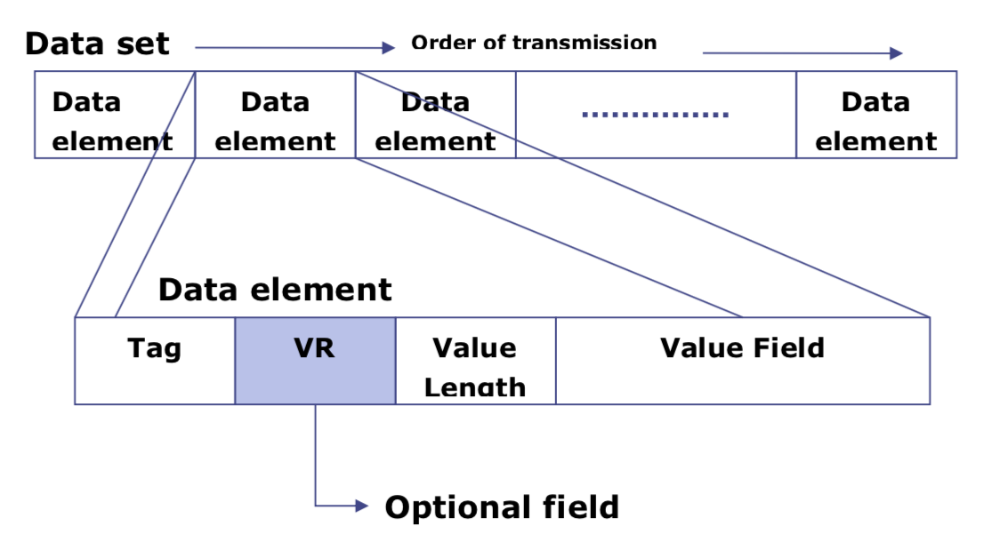
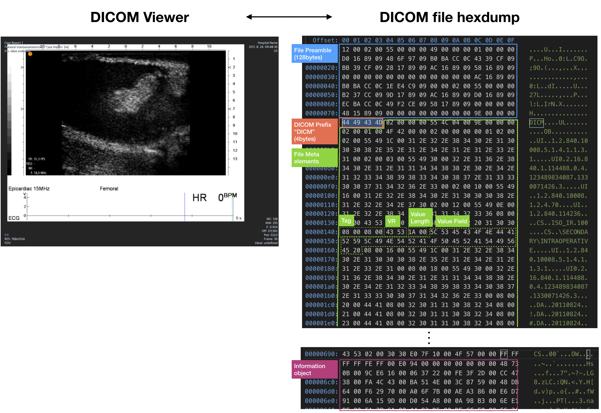
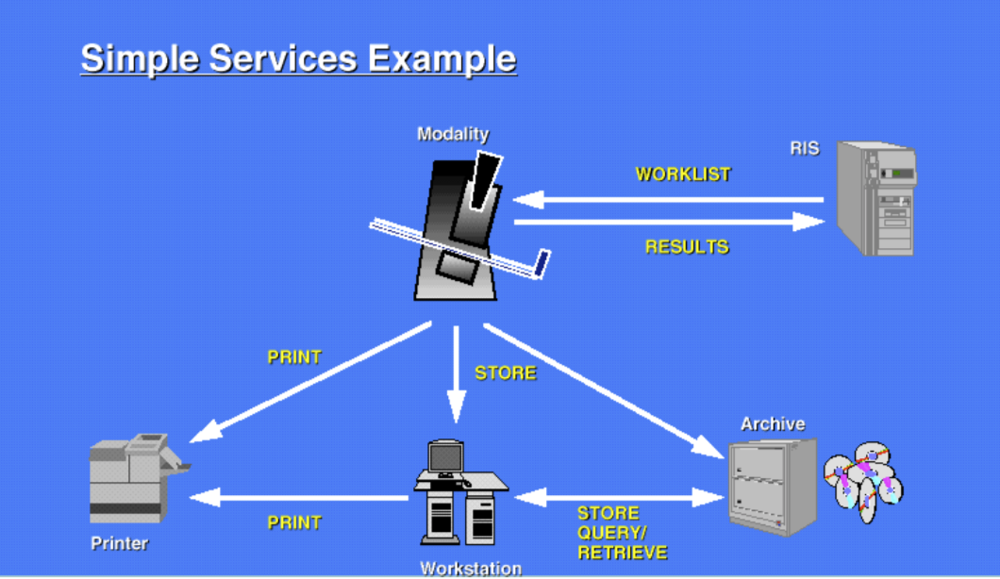

# 1. DICOM이란?
- DICOM(Digital Imaging and Communications in Medicine)은 의료용 디지털 영상의 저장, 출력 및 전송에 사용 되는 여러가지 표준을 총칭하는 말이다.
- DICOM 표준을 따르는 파일의 확장자는 .dcm을 사용한다. 

# 2. DICOM의 필요성
- X-ray 촬영, 초음파 검사, CT 촬영, MRI 촬영 등 다양한 의료용 디지털 영상 촬영 장비가 개발됨에 따라 각 장비에서 촬영한 영상을 효율적으로 통합하여 관리 및 조회할 필요가 생겼고, 서로 다른 제조사 간의 호환성 문제가 대두되었다. 예를 들어 다양한 워드 프로세서(ex: MS워드, Mac Pages, 한글 등)로 글을 작성할 경우 각기 다른 포맷의 파일(ex: .doc, .pages, .hwp)은 호환성의 문제가 있지만, pdf 포맷으로 저장할 경우 하나의 뷰어로 관리 및 조회할 수 있다. 이처럼 다양한 제조사 장비와 다양한 종류의 영상 간의 호환을 위한 표준이 필요했다.
- 한편 의료 영상은 일반적인 영상과 달리 환자 정보, 검사 정보 등 의료 영상으로서 효과적으로 사용하기 위해 영상 자체 정보 외에 고유한 정보들을 함께 저장해야 한다. 또한 촬영 장비, OCS(처방전달시스템), PACS(의료영상저장전송시스템), 아카이브, 프린터 등 의료 영상과 관련한 다양한 장비들간의 통신을 위해서는 네트워크 프로토콜도 필요하다. (의료용 영상은 환자의 개인정보가 있어 보안 이슈가 중요하여 독립된 프로토콜이 필요) 이러한 목적을 위해 새로운 표준의 개발이 필요했으며 그렇게 개발된 것이 DICOM이다. 

# 3. DICOM의 역사
- 위에서 언급한 필요성에 따라, DICOM은 ACR(American College of Radiology)와 NEMA(National Electrical Manufacture Association)에 의해 개발되었다.
- 1985년 첫번째 표준이 ACR/NEMA 300라는 이름으로 출시 되었으며, 지속적인 수정을 거쳐 1993년에 출시된 버젼부터 DICOM이라는 이름으로 명명 되었고, 현재까지도 지속적으로 개선되고 있다.

# 4. DICOM File
- 환자의 신상 정보, 수행한 검사 정보, 영상 자체의 정보 등 '의료용 영상 파일" 데이터를 규정하기 위해 필요한 다양한 속성들이 존재한다. 이러한 속성들을 "attribute"라 하며, 수천 개 가량이 존재하고 (참고 : [NEMA DICOM 표준 문서 - Part 6.Data Dictionary](http://dicom.nema.org/Dicom/2011/11_06pu.pdf)) 각각은 아래 4가지 사항으로 정의된다.
    - Attribute Name : 속성 이름
    - Tag : 시스템이 해당 속성을 식별하는 용도로 사용하는 4byte의 값 
    - Type : 속성 입력의 필수/선택 여부 관련 정보 
    - Attribute description : 해당 속성에 대한 상세한 설명

(Fig 1. Attribute의 예시 - Parent's Name, Parent ID (출처 : [NEMA DICOM 표준 문서 - Part 3. Information Object Definitions](http://dicom.nema.org/medical/dicom/2016d/output/chtml/part03/sect_C.2.2.html))
- 수천 개 가량의 attribute는 연관성에 따라 소분류인 "module", 대분류인 "Information Entities(IE)"로 분류된다. (ex: Multi-frame 이미지의 프레임 개수를 나타내는 "Number of Frames" attribute는 "Multi-frame" module에 속하며, 이 모듈은 "Image" IE에 속한다.)
- 한편 CT Image, MR Image, Digital X-Ray Image 등 영상의 종류에 따라 데이터를 규정하기 위해 필요한 attribute들이 다를 수 있는데, 이에 따라 각 영상의 종류는 "IOD(Inofrmation Object Definition)"라는 것으로 정의되고 각 IOD마다 필요한 attribute들이 각각 정의되어 있다. 

(Fig 2. US Multi-frame IOD를 구성하는 모듈들과 그 중 Multi-frame모듈에 속하는 Attribute들 (출처: [DICOM Standard Browser by Innolitics](https://dicom.innolitics.com/ciods))
- DICOM 파일은 아래와 같이 구성되어 있다. 
  - File Preamble (128byte) : 특별한 사용이나 application profile을 위해 사용될 수 있음
  - DICOM prefix (4byte) : File Preamble 다음에 나오는 prefix로 해당 파일이 DICOM이라는 것을 명시함
  - File Meta elements : 파일에 대한 Attribute를 Data element의 모음으로 나타냄 
  - Information object : 이미지/영상 데이터 

(Fig 3. DICOM 파일 구성 이미지 (출처: [DICOM Cookbook 번역본](http://cgac.chungbuk.ac.kr/Uploads/LECTURE/DICOM-COOKBOOk.doc))
- DICOM 파일 구성 중 File Meta elements 부분은 아래와 같은 방식으로 구성되는데, 각 data element마다 순서대로 attribute 정보가 저장되며 각 data element는 아래 4가지 사항으로 구성된다.
    - Tag (4byte) : 앞서 정의된 attribute의 tag로 어떠한 attribute인지를 명시
    - VR (Value Representation) (2byte) :  속성 값의 타입을 명시 (VR 리스트 : [NEMA DICOM 표준 문서 - Part 5.Data Structures and Encoding](http://dicom.nema.org/Dicom/2013/output/chtml/part05/sect_6.2.html))
    - Value Length (2 or 4byte) : Value Field의 길이를 명시
    - Value Field : 해당 attribute에 대해 실제로 담긴 정보 

(Fig 4. File Meta elements 부분 구성 이미지 (출처: [DICOM Cookbook 번역본](http://cgac.chungbuk.ac.kr/Uploads/LECTURE/DICOM-COOKBOOk.doc))
- 아래는 https://medistim.com/dicom/ 에서 제공하는 예시 DICOM 파일을 뷰어로 확인한 경우와 hexdump한 경우를 비교한 것이다. 

(Fig 5. 예시 DICOM 파일 뷰어 이미지와 hexdump)
 
  
# 5. DICOM Network

(Fig 5. DICOM Network 예시 (출처: [DICOM Cookbook 번역본](http://cgac.chungbuk.ac.kr/Uploads/LECTURE/DICOM-COOKBOOk.doc))
- Server/Client 모델로 동작하며 Server역할 (요청을 대기하며 요청에 대해 응답)을 하는 것을 SCP (Server Class Provider)라 하고, Client 역할 (파일 전송, 탐색, 복사 등 특정한 행동을 서버에 요청)을 하는 것을 SCU (Server Class User)라 한다. SCP/SCU 등 통신의 대상이 되는 단위를 AE (Application Entity)라 한다. 1개의 장비가 SCP/SCU를 동시에 수행할 수 있다. 
- 영상의 종류가 매우 다양하므로 각 영상 종류 (IOD, Information Object Definition)에 대해 어떠한 작업을 할 것인지 (DIMSE, DICOM Service Element)를 조합하는 등 하나의 완전한 행위를 의미하는 정의 단위를 SOP (Service-Object Pair) Class라 하며 AE에 대해 특정한 작업 수행 전에 이를 등록한다. 
- Storage Service Class : 촬영 영상장비 등(SCU역할)이 DICOM 파일을 워크스테이션 또는 아카이브 등(SCP 역할)에 전송하여 저장하는 서비스로 DICOM 서비스 중 가장 기본적이며 많이 사용되는 서비스이다. SCU가 SCP에게 C-STORE 요청 메시지를 보내고 SCP가 받은 후에 응답 메시지를 보낸다. 
- Query/Retrieve Service Class : SCU가 특정한 필터 조건으로 SCP에 저장된 많은 DICOM 파일들을 검색 (C-FIND), 검색 조건에 맞는 파일을 SCU에 가져오기(C-GET), 검색 조건에 맞는 파일을 다른 SCP로 전송 (C-MOVE) 시키는데 사용되는 서비스이다.

# 6. 참고 링크 
* https://en.wikipedia.org/wiki/DICOM
* https://ko.wikipedia.org/wiki/의료용_디지털_영상_및_통신_표준
* https://blog.naver.com/infinitt-healthcare/220902279599
* https://ko.wikipedia.org/wiki/의료영상저장전송시스템
* https://blog.naver.com/infinitt-healthcare/220885977992
* http://cgac.chungbuk.ac.kr/Uploads/LECTURE/DICOM-COOKBOOk.doc
* https://www.dicomlibrary.com/dicom/sop/
* https://www.dicomlibrary.com/dicom/transfer-syntax/
* https://dicom.innolitics.com/ciods
